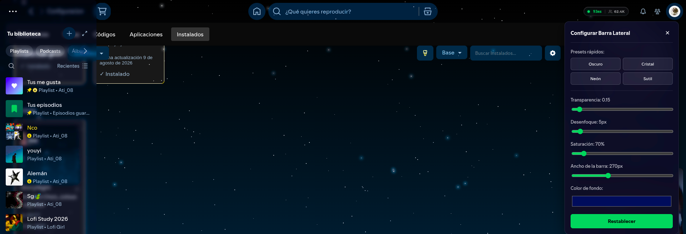

# Barra Lateral Config para Spicetify

Una extensión que convierte tu barra lateral izquierda en un panel dinámico con efecto de cristal esmerilado.

## ✨ Características

- 🎨 **Oculta la barra lateral** y la muestra al pasar el mouse por el borde izquierdo.
- 💎 **Fondo con efecto cristal esmerilado** (blur + saturación personalizables).
- 🎛️ **Panel de configuración integrado** para ajustar en tiempo real:
  - Transparencia
  - Desenfoque (Blur)
  - Saturación
  - Ancho de la barra
  - Color de fondo
- 🌈 **Presets rápidos**: Oscuro, Cristal, Neón y Sutil.
- 💾 **La configuración se guarda automáticamente** en tu equipo.
- ⚡ **Animaciones optimizadas** con GPU para una experiencia fluida.

## 📸 Vista Previa



*La barra lateral con efecto cristal esmerilado, combinada con el tema StarryNight.*

## 🛠️ Instalación

### Requisitos previos
- Tener [Spicetify](https://spicetify.app/) instalado y funcionando.
- Tener un tema aplicado (opcional, pero recomendado para el mejor aspecto).

### Pasos

1. Descarga el archivo `barra-lateral-config.js` desde la carpeta [`dist/`](dist/) de este repositorio.

2. Colócalo en tu carpeta de extensiones de Spicetify:

   - **Windows**: `%appdata%\spicetify\Extensions\`
   - **Linux/Mac**: `~/.config/spicetify/Extensions/`

3. Actívala con el comando:

   ```bash
   spicetify config extensions barra-lateral-config.js
   spicetify apply

4. Cómo usarla
 Acerca el mouse a donde estaba la barra y esta aparecera, aleja el mouse y la barra desaparecera.
 Click en el boton de configuración para mover la saturación, transparencia, etc, a tu gusto.

         Si quieres modificar o mejorar esta extensión
          # Clonar el repositorio
                git clone https://github.com/TuUsuario/barra-lateral-config.git
                   cd barra-lateral-config

     # Instalar dependencias
        npm install

         # Compilar en modo desarrollo
         npm run build

              # Copiar a Spicetify y aplicar
              cp dist/barra-lateral-config.js ~/.config/spicetify/Extensions/
               spicetify apply
Créditos
Creado con @spicemod/creator.
Inspiracion por el codigo New Hover Panel 
Inspirado por el tema StarryNight.
